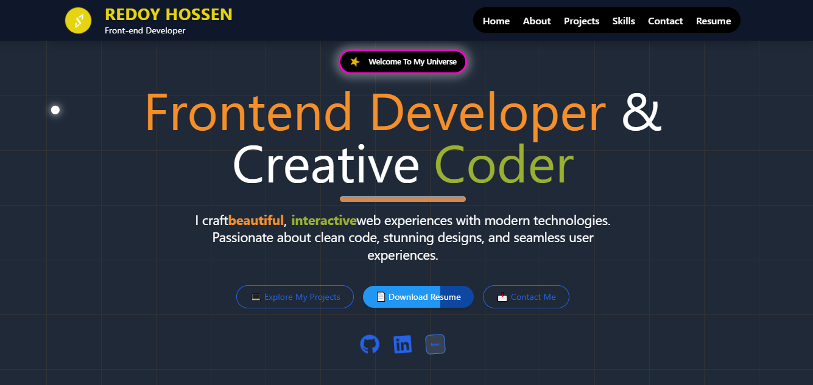
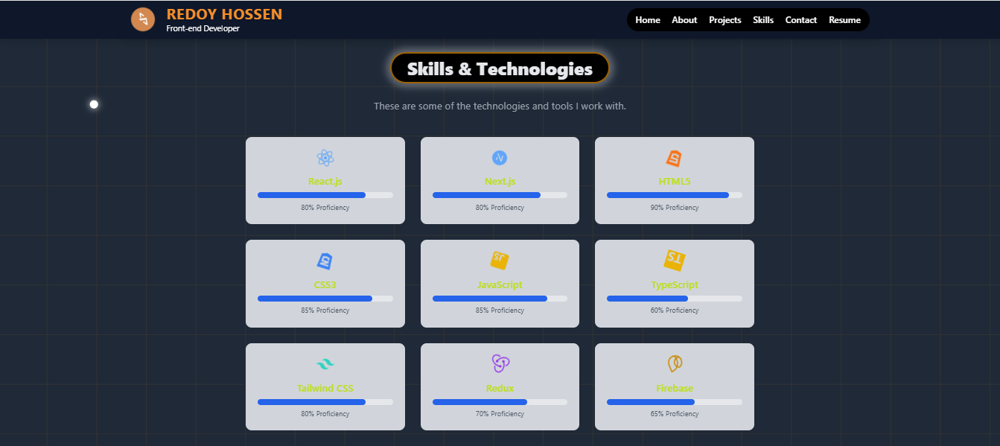

# 🚀 Personal Portfolio — MD Redoy Hossen

Welcome to my personal portfolio!  
A modern, fast, and fully responsive portfolio website built with **React.js**, **Vite**, **Tailwind CSS**, smooth animations, and a custom interactive user interface.  
This portfolio highlights my projects, skills, and professional journey as a Frontend Developer.

---

## 🔗 Live Demo

🌍 **Visit Website:**  
https://my-portfolio-ashen-psi-30.vercel.app

---

## 📦 GitHub Repository

📁 **Source Code:**  
https://github.com/redoyhossen49/my-portfolio

---

## ✨ Features

- ⚡ **Super fast** performance with Vite
- 📱 **Fully responsive** design
- 🎨 Modern UI with Tailwind CSS
- 🖱️ **Custom animated cursor**
- 🌈 Smooth background transition & animations
- 📁 Interactive Projects Showcase
- 📬 Contact form powered by **Formspree**
- 🎯 Clean and optimized folder structure
- 🔗 Includes live project links & GitHub links

---

## 🛠️ Technologies Used

| Technology                         | Purpose                      |
| ---------------------------------- | ---------------------------- |
| **React.js**                       | Component-based UI           |
| **Vite**                           | Fast development environment |
| **Tailwind CSS**                   | Modern utility-first styling |
| **Formspree**                      | Contact form backend         |
| **React Icons**                    | Icon library                 |
| **CSS Animations / Custom Cursor** | Interactive UI               |
| **Vercel**                         | Deployment platform          |

---

## 📂 Folder Structure

my-portfolio/
│
├── public/ # Static files
│ ├── images/
│ └── favicon.ico
│
├── src/
│ ├── components/
│ │ ├── Navbar.jsx
│ │ ├── Footer.jsx
│ │ ├── CustomCursor.jsx
│ │ └── ...
│ ├── Pages/
│ │ ├── Home.jsx
│ │ ├── About.jsx
│ │ ├── Projects.jsx
│ │ ├── Skills.jsx
│ │ ├── Contact.jsx
│ │ └── Resume.jsx
│ ├── App.jsx
│ ├── main.jsx
│ └── assets/
│
├── tailwind.config.js
├── postcss.config.js
├── package.json
└── README.md

---

## 🧑‍💻 Installation & Run Locally

If you want to run this project locally:

````bash
# Clone the repository
git clone https://github.com/redoyhossen49/my-portfolio

# Go to project folder
cd my-portfolio

# Install dependencies
npm install

# Run development server
npm run dev

#Then visit:
http://localhost:5173

## 📬 Contact Form (Formspree)

The portfolio includes a working contact form powered by **Formspree**.

### Example Usage

```html
<form action="https://formspree.io/f/{your-id}" method="POST">
  <input type="text" name="name" required />
  <input type="email" name="email" required />
  <textarea name="message" required></textarea>
  <button type="submit">Send</button>
</form>


Add your project screenshots here:

## 📸 Screenshots

### 🏠 Home Page


### 📂 Projects Page


### 🛠 Skills Page


### ✉️ Contact Page

	


## 🤝 Connect With Me

- **GitHub:** https://github.com/redoyhossen49
- **Portfolio:** https://my-portfolio-ashen-psi-30.vercel.app
- **Email:** redoyhossen49 @example.com


---

## ⭐ Support

If you like this portfolio, please consider giving it a **GitHub Star ⭐**.
Your support motivates me to build more amazing projects!
````
